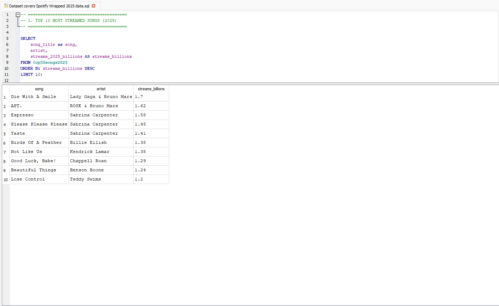

# 🎧 Spotify Data Analysis (2025)

## 📌 Project Overview
This project analyzes Spotify streaming data for 2025 to identify trends in song popularity, artist dominance, and ranking dynamics.

---

## 🛠️ Tools & Technologies
- SQL (SQLite)
- GitHub
- CSV datasets (Kaggle)

---

## 📊 Key Analyses

### 1. Top 10 Most Streamed Songs (2025)

👉 Insight: The most streamed songs significantly outperform others, indicating a strong popularity gap.

---

### 2. Top Artists by Total Streams (2025)

👉 Insight: A small group of artists dominates total streaming volume, suggesting a winner-takes-most dynamic.

---

### 3. Relationship Between Streams and Ranking Presence (2025)

👉 Insight: Artists with higher total streams tend to appear more frequently in the Top 50, indicating a concentration of popularity.

---

## 📂 Dataset
Spotify Wrapped 2025 dataset (Kaggle)

---

## 🎯 Key Takeaways
- Streaming distribution is highly uneven  
- Top artists dominate the platform  
- Popularity strongly influences ranking presence  

---

## 🚀 Project Purpose
This project was created as part of my journey toward becoming a Data Analyst, focusing on SQL and data exploration.
